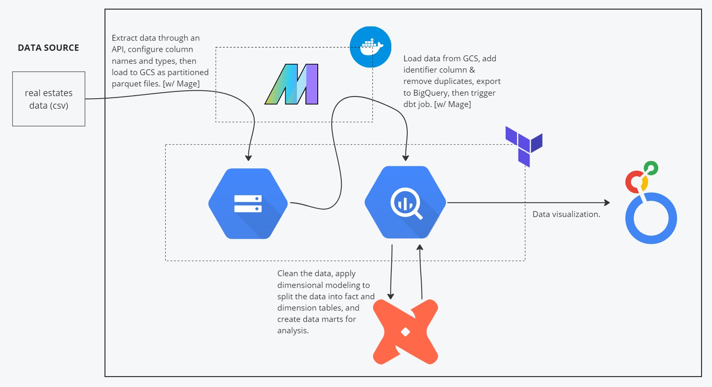
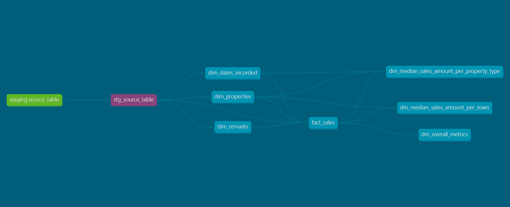
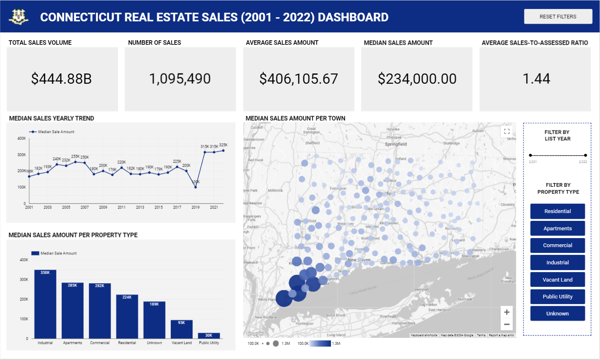

# Real Estate Sales Data Pipeline

## About the Data

The dataset contains all Connecticut real estate sales with a sales price of $2,000 or greater  
that occur between October 1 and September 30 of each year from 2001 - 2022.  
The data is a csv file which contains 1097629 rows and 14 columns, namely:

| Column Name | Description |
|------------ | ----------- |
| Serial Number | Serial number of the property |
| List Year | Year the property was listed for sale |
| Date Recorded | Date the sale was recorded locally |
| Town | Town the property is located at |
| Address | Property Address |
| Assessed Value | Value of the property used for local tax assessment |
| Sale Amount | Amount the property was sold for |
| Sales Ratio | Ratio of the sale price to the assessed value |
| Property Type | Type of property |
| Residential Type | Type of Residence |
| Non Use Code | Determines whether sale price is not reliable for use in the determination of a property's value |
| Assessor Remarks | Remarks from the assessor on the property |
| OPM Remarks | Remarks from Office of Policy and Management (OPM) on the property |
| Location | Geographic coordinates (Longitude, Latitude) |

## Problem Description
This pipeline project aims to answer these main questions:

- Which towns will most likely offer properties within my budget?
- What is the typical sale amount for each property type?
- What is the historical trend of real estate sales?

## Technology Stack
- Google Cloud Virtual Machine (Virtual Environment)
- Google Cloud Storage (Data Lake)
- BigQuery (Data Warehouse)
- Terraform (Infrastructure As Code)
- Docker & Docker Compose (Containerization)
- Mage (Workflow Orchestration)
    - Reason for using Mage - I figured that as a complete beginner in the field of data and technology, it was better not to overwhelm myself too much. After doing a little bit of research, Mage seemed to be the one most suitable for me, a beginner, in order to create my first data engineering project. In the near future, I plan to learn other workflow orchestration tools such as Airflow, Prefect, and Dagster.
- dbt Cloud (Transformation)
- Looker Studio (Visualization)

## Pipeline Architecture

- Set up a virtual environment using Google Cloud Compute Engine as to not consume my own laptop's storage when installing dependencies, it also provides faster download speeds, and better performance.
- Used Docker and Docker Compose to containerize the Mage instance.
- Set up the infrastructure for Google Cloud Storage (GCS) bucket and Google BigQuery dataset using Terraform.
- Mage is used to move data from the data source into a GCS bucket (data lake), and BigQuery dataset (data warehouse).
- Created models to transform the data:
  - Applies dimensional modeling to split the data into fact and dimension tables
  - Adds surrogate keys as identifiers for each table
  - Creates tables that contain specific parts of the data for data analysis
  - Cleansed the data in the data mart. Removed NULL sale amounts and location, and only included sale amounts which are $2000 or higher (since it was said in the data description)
 
## Table Schemas
### fact_sales
| Column Name | Data Type | Constraints | Description |
| ----------- | --------- | ----------- | ----------- |
| sale_id | INTEGER | not null, primary key | Sales identifier created in Mage |
| serial_number | INTEGER | | Serial number of property (apparently these are not unique) |
| list_year | INTEGER | | Year the property was listed for sale |
| date_recorded_id | STRING | Not Null, Foreign Key to dim_dates_recorded (date_id) | Date recorded ID |
| property_id | STRING | Not Null, Foreign Key to dim_properties (property_id) | Property ID |
| remark_id | STRING | Not Null, Foreign Key to dim_remarks (remark_id) | Remark ID |
| assessed_value | FLOAT | | Value of the property used for local tax assessment |
| sale_amount | FLOAT | | Amount the property was sold for |
| sales_ratio | FLOAT | | Ratio of the sales price to assessed value |
| non_use_code | STRING | | Determines whether sale price is not reliable for use in the determination of a property's value |

### dim_dates_recorded
| Column Name | Data Type | Constraints | Description |
| ----------- | --------- | ----------- | ----------- |
| date_id | STRING | Not Null, Primary Key | Surrogate key for dim_dates_recorded |
| date | DATE | | Date the sale was recorded locally |
| year | INTEGER | | Year extracted from the date recorded |
| month | INTEGER | | Month extracted from the date recorded |
| day | INTEGER | | Day extracted from the date recorded |

### dim_properties
| Column Name | Data Type | Constraints | Description |
| ----------- | --------- | ----------- | ----------- |
| property_id | STRING | Not Null, Primary Key | Surrogate key for dim_properties |
| property_type | STRING | | Type of property |
| residential_type | STRING | | Type of residence if property type is residential |
| town | STRING | | Town the property is located at |
| address | STRING | | Property address |
| location | STRING | | Geographic corrdinates of the property (Longitude, Latitude) |

### dim_remarks
| Column Name | Data Type | Constraints | Description |
| ----------- | --------- | ----------- | ----------- |
| remark_id | STRING | Not Null, Primary Key | Surrogate key for dim_remarks |
| assessor_remark | STRING | | Remarks from the assessor on the property |
| opm_remark | STRING | | Remarks from the Office of Policy and Management (OPM) on the property |

## DBT Transformation Lineage Graph

# Visualization

[Link to the Dashboard](https://lookerstudio.google.com/reporting/fadbe10e-9b4a-4007-8dd7-e407aa03e144)
- The top part of the dashboard content shows the overall metrics of real estate sales in Connecticut, such as the `total sales volume`, `number of sales`, `average sales amount`, `median sales amount`, and the `average sales-to-assessed ratop`. These provides summary aggregations of the data.
- Used median as the measure of central tendency for the other charts, since the data is heavily skewed to the right.
- The time series graph shows the yearly pattern for the median sales. The last 3 years (2020, 2021, 2022) have had increased amount of median sales.
- The column chart provides the median sales amount per property type.
- A bubble map is also included to visualize the data on the map. Each bubble represent a town in connecticut, and larger sizes & darker colors correspond to higher median sales amount. We can see that the median sales amount tends to be higher in towns located at the southwest area of Connecticut.
- Filter options are included at the right side of the dashboard wherein you can filter by list year or by property type.

## [You can click here for the setup to reproduce the project](https://github.com/ranzbrendan/real_estate_sales_de_project/blob/main/setup.md)

